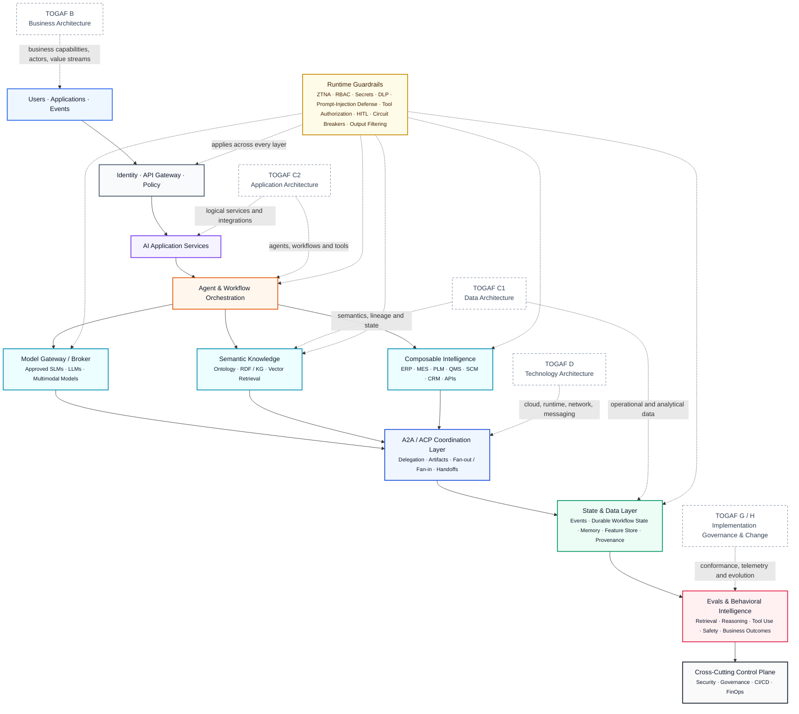
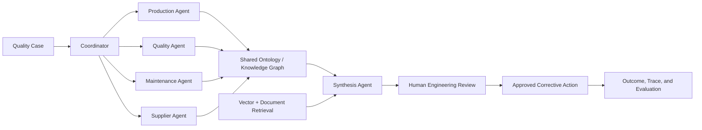

# Enterprise AI Substrate

## Architectural thesis

> Why I chose "substrate" (in other words, no, Claude did not choose this term - I came up with it myself LOL).  In science (biology and ecology) a substrate is the base surface or foundational medium upon which an organism grows, moves, or attaches itself.In AI hardware, a substrate is the ultra-thin base layer that connects, supports and facilitates communication between multiple chips (GPUs), high-bandwidth memory, etc inside a single processor package.  Because modern AI demands massive speed and power, AI substrates are highly advanced interconnects.  
> Sophisticated enterprises with high volume AI usage, multiple teams building agents and mulitple systems being accessed by those agents, require this high-power, high-capacity and highly capable AI substrate. The very living fabric/foundational mdeium upon which enterprise AI can grow.   

The architecture begins with a **business need, user interaction, application request, or enterprise event**—not with a model. It then applies identity and policy, exposes reusable AI application services, coordinates agentic workflows, grounds reasoning in semantic knowledge, invokes approved enterprise capabilities, maintains durable state, and continuously evaluates behavior and business outcomes.

## Reference architecture




## Walkthrough

### 1. Users, applications, and events

Requests can originate from employees, engineers, plant applications, dealer systems, suppliers, scheduled jobs, telemetry, or operational events.

The first questions are:

- What business process or value stream initiated the interaction?
- What decision or outcome is being supported?
- What degree of autonomy is appropriate?
- Who remains accountable for the result?

**TOGAF mapping:** Architecture Vision and Business Architecture.

### 2. Identity, API gateway, and policy

Before AI receives context or invokes an action, the platform establishes identity, authorization, organizational scope, data classification, quotas, and regional constraints.

This includes identity provider integration, RBAC, zero-trust access, API management, secrets, DLP, entitlement-aware retrieval, and model-use policy.

### 3. AI application services

This layer exposes reusable business-facing capabilities such as:

- Quality-investigation assistance
- Maintenance diagnostics
- Supplier-impact analysis
- Engineering knowledge assistance
- Warranty and dealer-case intelligence
- Document understanding
- Conversational and multimodal interfaces

These are logical application services, not individual prompts.

**TOGAF mapping:** Phase C2, Application Architecture.

### 4. Agent and workflow orchestration

The orchestration layer manages sequential and parallel agent patterns, branching, retries, checkpoints, human approval, tool selection, long-running workflows, exception handling, fan-out/fan-in, compensation, and rollback.  For reference, a "fan-out" means that one coordinator decomposes a problem into multiple independent workstreams.  An agentic "fan-in" means the convergence of those independent workstreams back into a single decision point.

****An multi-agent that "fans out" (could also be a single agent "fanning out" to multiple Systems of Record via tool calls, etc)

```

                    Coordinator
                         |
       +-----------------+-----------------+
       |                 |                 |
 Production Agent   Supplier Agent   Quality Agent
       |                 |                 |
     MES               SCM/QMS         Inspection Data

```

****A "fan-in" (maybe dovetail?):  Here we see the results of each sub-agent competency being synthesized (e.g., via a shared enterprise semantic/ontology layer)

                    Coordinator
                         |
       +-----------------+-----------------+
       |                 |                 |
 Production Agent   Supplier Agent   Quality Agent
       |                 |                 |
       +-----------------+-----------------+
                         |
                  Synthesis Agent
                         |
                 Recommendation


> The workflow is the technical expression of the approved business process.

### 5. Model gateway or broker

The gateway decouples applications from individual models and routes by task, modality, quality, latency, cost, privacy, residency, context needs, availability, and approved-use policy.

The model becomes a replaceable capability behind a governed interface.  The term I like to use here is "hot swap", or from back in my military days "selective interchange".  

### 6. Semantic knowledge

Semantic knowledge combines:

- Enterprise ontology
- RDF triples and knowledge graphs (or OWL, for a more complex approach).  
- Canonical entity resolution
- Vector (semantic) and knowledge graph (graph DB) retrieval
- Metadata and entitlement filters
- Provenance and lineage
- Domain rules and constraints

Vector search identifies semantic similarity. The ontology and graph provide identity, structure, lineage, provenance, and multi-hop relationships.

For multi-agent systems, this becomes a **shared semantic workspace**: parallel agents enrich the same canonical entities, while serial agents preserve the distinction between observed facts, user reports, hypotheses, approvals, and executed actions.

**TOGAF mapping:** Phase C1, Data Architecture.

### 7. Composable intelligence

Agents invoke approved, typed services that wrap systems such as ERP, MES, PLM, QMS, SCM, CRM, maintenance, warranty, event streams, and enterprise APIs.

Tool contracts enforce validation, authorization, idempotency, timeouts, auditability, and bounded side effects.

### 8. A2A / ACP coordination

A2A-, ACP-, or comparable protocol patterns support delegation and artifact exchange across agents.

The coordination layer carries task identity, canonical entity references, intermediate artifacts, handoff metadata, completion events, errors, and fan-in synchronization.

> The ontology provides semantic interoperability. A2A or ACP provides protocol interoperability.

### 9. State and data

The platform separates conversation state, workflow state, system-of-record state, durable memory, events, checkpoints, evaluation datasets, feature-store data, provenance, and audit artifacts.

Conversation history is not the business source of truth. Structured workflow and enterprise state remain explicit outside the model.

### 10. Evals and behavioral intelligence

Evaluation spans the whole decision system:

- Query and task formulation
- Retrieval recall, precision, MRR, and nDCG: WARNING - Information Retrieval is still very much a science and not a SWAG.  
- Ranking and context assembly
- Groundedness and citation quality
- Reasoning and plan quality
- Tool selection and argument correctness
- Policy and safety adherence
- Agent trajectory and retry behavior
- Latency, reliability, and cost
- Human acceptance and business outcomes

Production traces feed replay, regression, anomaly detection, drift analysis, and architecture change management.

### 11. Cross-cutting control plane

**Security:** ZTNA, RBAC, secrets, DLP, prompt-injection defenses, tool authorization, HITL, circuit breakers, kill switches, rollback, and output filtering.

**Governance:** model, prompt, ontology, workflow, and tool versioning; risk classification; provenance; architecture decisions; audit evidence; responsible-AI controls.

**CI/CD:** automated tests and evaluation gates; SAST, DAST, SCA, IaC scanning; staged deployment; versioning; rollback and reproducibility.

**FinOps:** model and infrastructure economics (more lovingly, tokenomics), cost per completed business outcome, routing, caching, capacity tradeoffs, and ROI.

## TOGAF alignment

| TOGAF area | AI-substrate concern |
|---|---|
| Architecture Vision | Business outcome, scope, stakeholders, autonomy, risk |
| Business Architecture | Capabilities, processes, actors, decisions, accountability |
| C1: Data Architecture | Ontology, KG, RAG, state, lineage, provenance, feature data |
| C2: Application Architecture | AI services, agents, workflows, APIs, tools, integration |
| Technology Architecture | Cloud, runtime, network, messaging, storage, observability |
| Opportunities & Solutions | Reuse, build-versus-buy, pilots, transition architectures |
| Migration Planning | Read-only → recommendation → approved action → bounded autonomy |
| Implementation Governance | Conformance, eval gates, tool permissions, deployment controls |
| Architecture Change Management | Drift, incidents, model changes, telemetry, cost, feedback |

## Manufacturing example: quality investigation



The agents use common entities such as VIN, production order, plant, line, shift, machine, tool, process step, part lot, supplier, inspection, defect, and quality case. They investigate different domains in parallel while preserving a shared semantic and evidentiary model.

The graph narrows the investigation and surfaces structurally related evidence. It does not independently prove causality.
